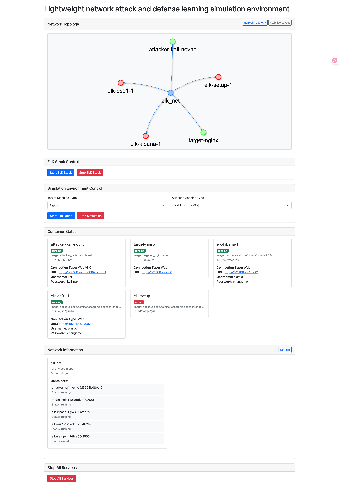

# Lightweight-network-attack-and-defense-learning-simulation-environment
# 輕便化之網路攻防學習模擬環境

這是一個基於 Docker 的網路安全模擬環境，包含 ELK 日誌分析系統和攻擊模擬環境。

## 系統需求

- Docker
- Docker Compose
- Python 3.8+
- Make

## 運行環境

### ELK 堆疊
- Elasticsearch: 9.0.0
- Logstash: 9.0.0
- Kibana: 9.0.0

### 目標機器
- Nginx: latest
- Httpd: latest

### 攻擊機器
- Kali Linux: latest
  - noVNC: 基於網頁的 VNC 客戶端
  - Xrdp: 遠端桌面協議
  - X11: X 視窗系統

## 安裝步驟

1. 克隆倉庫：
```bash
git clone <repository-url>
cd <repository-name>
```

2. 安裝 ELK 環境：
```bash
cd ELK
python make.py install
```

3. 安裝模擬環境：
```bash
cd Machines
python make.py install
```
安裝過程中，你需要選擇要構建的內容：
- 1: 僅構建目標機器（Targeted）
- 2: 僅構建攻擊機器（Attacker）
- 3: 構建預設機器（Nginx + noVNC Kali）
- 4: 構建所有機器

然後選擇具體的機器類型進行構建。

4. 安裝 Python 依賴：
```bash
cd Web
pip install -r requirements.txt
```

## 運行說明

1. 啟動網頁界面：
```bash
cd Web
python app.py
```

2. 訪問網頁界面：
- 打開瀏覽器訪問 `http://localhost:5000`

3. 使用指南：
- 點擊 "Start ELK Stack" 啟動 ELK 環境
- 選擇目標機器類型（Nginx/Httpd）和攻擊機器類型（Kali）
- 點擊 "Start Simulation" 啟動模擬環境
- 使用 "Stop Simulation" 停止模擬環境
- 使用 "Stop ELK" 停止 ELK 環境

## 功能說明

### ELK 環境
- Elasticsearch：用於存儲和檢索日誌數據
- Logstash：用於日誌收集和處理
- Kibana：用於日誌可視化和分析

### 模擬環境
- 目標機器：
  - Nginx：網頁伺服器
  - Httpd：網頁伺服器
- 攻擊機器：
  - Kali Linux：滲透測試系統
  - 支援多種遠端訪問方式（noVNC/Xrdp/X11）

## 管理命令

在 Machines 目錄下，你可以使用以下命令管理模擬環境：

```bash
# 啟動所有容器
python make.py start

# 停止所有容器
python make.py stop

# 移除所有容器和卷
python make.py remove
```

## 注意事項

1. 首次啟動 ELK 環境可能需要較長時間，請耐心等待
2. 確保系統有足夠的記憶體運行 ELK 環境（建議至少 4GB）
3. 如果遇到權限問題，請確保 Docker 服務正在運行
4. 停止服務時，請使用對應的停止按鈕，避免直接關閉容器
5. 安裝模擬環境時，確保已經構建了所需的 Docker 鏡像

## 故障排除

1. 如果 ELK 環境無法啟動：
   - 檢查系統記憶體是否足夠
   - 確認 Docker 服務是否正常運行
   - 查看 Docker 日誌獲取詳細信息

2. 如果模擬環境無法啟動：
   - 確保 ELK 環境已經正常運行
   - 檢查 Docker 網路配置
   - 確認已經正確構建了所需的 Docker 鏡像
   - 查看容器日誌獲取詳細信息

# 示範截圖


## 貢獻指南

歡迎提交 Issue 和 Pull Request 來幫助改進專案。

## 授權許可

[添加授權信息]